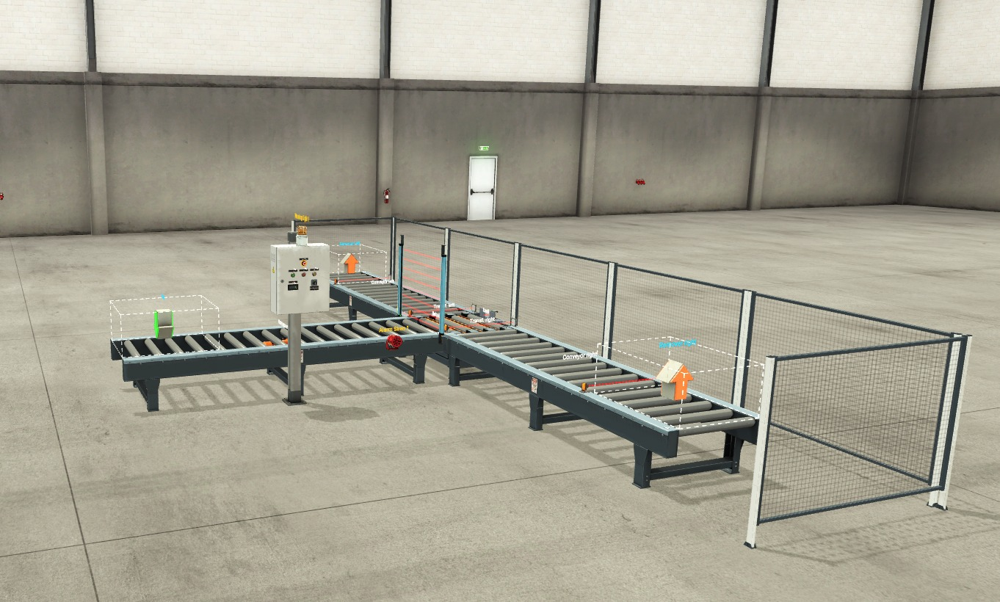
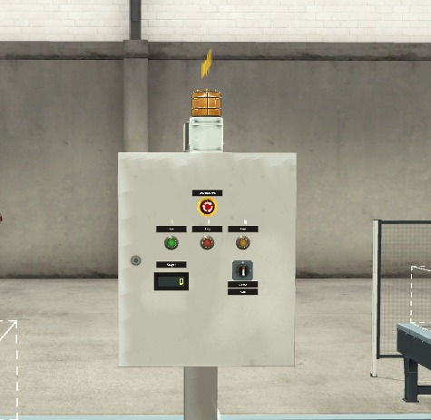
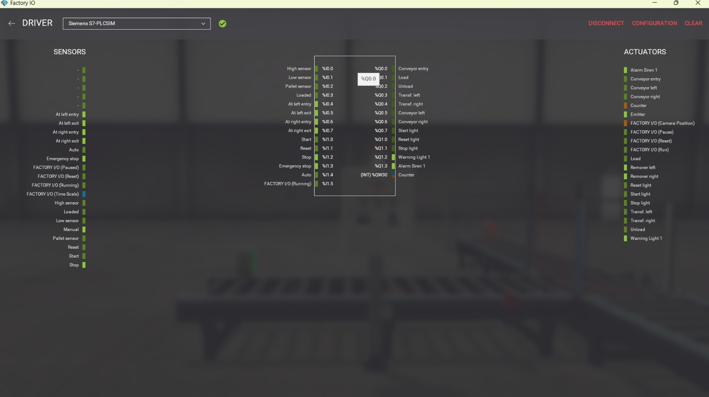
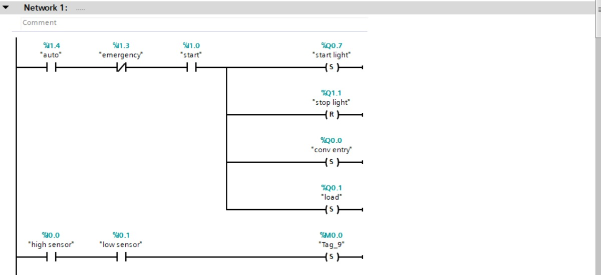
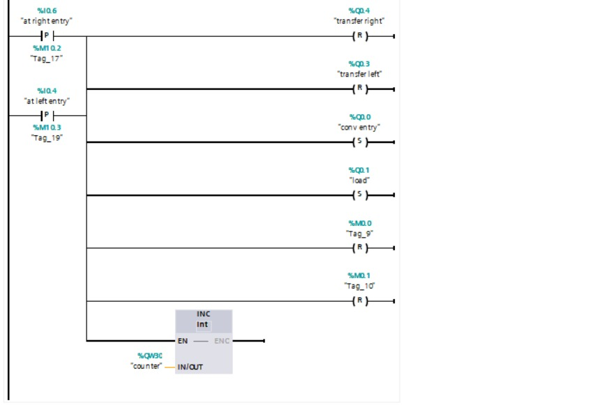
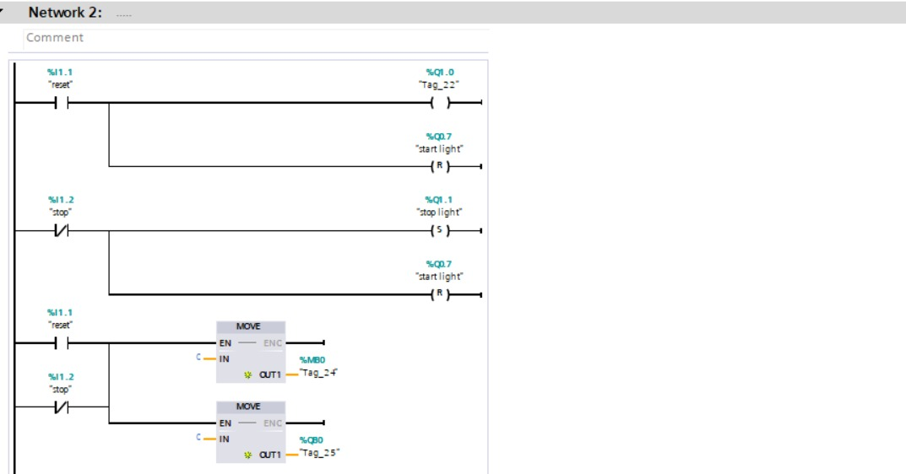
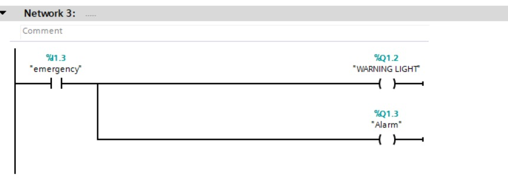

# PLC-Based Height Sorting System

An automated height-based sorting system developed using **Siemens TIA Portal**, **Factory I/O**, and **S7-PLCSIM**.

The system detects the height of incoming products and automatically routes them to the appropriate conveyor path while providing start/stop control, product counting, reset functionality, and emergency safety handling.

---

## Project Overview

This project was developed as a team academic project to simulate an industrial sorting process using PLC control.

Products enter the system through a conveyor and pass through height sensors. Based on the sensor readings, the PLC determines the product category and activates the appropriate transfer mechanism to route it toward the correct conveyor.

The system was designed and tested virtually using **Factory I/O** connected to a PLC program developed in **Siemens TIA Portal** and executed through **S7-PLCSIM**.

---

## System Features

- Automatic product sorting based on height
- High and low height detection sensors
- Left and right product routing
- Conveyor and transfer control
- Automatic product counter
- Start / Stop / Reset controls
- Automatic operating mode
- Emergency-stop handling
- Red warning indicator during emergency conditions
- Audible alarm siren
- Factory I/O and PLC simulation integration

---

## Factory I/O Simulation

The following screenshots show the simulated industrial environment and the connection between Factory I/O and the PLC control system.

### System Overview



### Control Panel



### PLC I/O Mapping



---

## Control Logic

The PLC program was implemented using **Ladder Logic (LAD)** in Siemens TIA Portal.

The control logic is organized around three main functions.

### Network 1 — Automatic Sorting

Handles the main operating sequence including:

- System startup
- Entry conveyor control
- Product loading
- Height detection
- Sorting decision
- Left/right transfer control
- Product counter update

#### System Startup and Height Detection



#### Transfer Control and Product Counter



### Network 2 — Stop & Reset

Handles:

- Normal stop operation
- System reset
- Clearing internal states
- Resetting outputs and counter when required



### Network 3 — Emergency Safety

Handles emergency conditions by activating:

- Red warning indicator
- Alarm siren
- Safe system response



---

## Operating Sequence

1. Factory I/O is connected to **S7-PLCSIM**.
2. The system is placed in automatic mode.
3. The emergency stop must be released.
4. The operator presses Start.
5. The entry conveyor moves the product into the sorting area.
6. Height sensors detect the product dimensions.
7. The PLC determines the required sorting direction.
8. The appropriate transfer mechanism routes the product.
9. The product counter is incremented after successful transfer.
10. Stop, Reset, and Emergency controls manage the system state when required.

---

## Engineering Iteration

The project was improved after the initial implementation based on instructor feedback.

The first version focused mainly on the automatic height-sorting sequence. The system was then refined to improve its control and safety behavior.

Additional features were introduced, including:

- Emergency warning indication
- Audible alarm siren
- Improved reset and emergency handling
- More structured PLC control logic

This iteration helped move the project from a basic sorting simulation toward a more complete industrial automation scenario.

---

## My Contribution

My work on the project included developing and configuring the **Factory I/O simulation environment** and contributing to the integration and improvement of the PLC-controlled sorting system.

I also participated in refining the project after instructor feedback, including the addition and testing of the emergency warning and alarm behavior.

---

## Technologies & Tools

- Siemens TIA Portal V17
- Siemens S7-PLCSIM
- Factory I/O
- Ladder Logic (LAD)
- PLC Programming
- Industrial Automation

---

## Repository Structure

```text
plc-height-sorting-system/
│
├── plc-project/
│   └── PLC_Height_Sorting_TIA_Portal_V17.zip
│
├── docs/
│   └── PLC_Height_Sorting_Report_FINAL_Touches.pdf
│
├── assets/
│   ├── factory_io_system_overview.jpeg
│   ├── factory_io_control_panel.jpeg
│   ├── factory_io_plc_mapping.jpeg
│   ├── ladder_network1_startup.jpeg
│   ├── ladder_network1_transfer_counter.jpeg
│   ├── ladder_network2_reset_stop.jpeg
│   └── ladder_network3_emergency_alarm.jpeg
│
└── README.md
```

---

## Project Files

The repository includes the original **Siemens TIA Portal V17 project archive**, allowing the PLC project to be opened and inspected in TIA Portal.

The complete project report is also included and provides additional details about the system design, PLC I/O mapping, Ladder Logic implementation, operating sequence, and project development.

- **PLC Project:** `plc-project/PLC_Height_Sorting_TIA_Portal_V17.zip`
- **Project Report:** `docs/PLC_Height_Sorting_Report_FINAL_Touches.pdf`

---

## Academic Project

This project was developed as part of an academic team project in **Mechatronics Engineering**.

The project provided practical experience in PLC programming, industrial automation, sensor-based control, virtual commissioning, and the integration of Siemens TIA Portal with Factory I/O.
